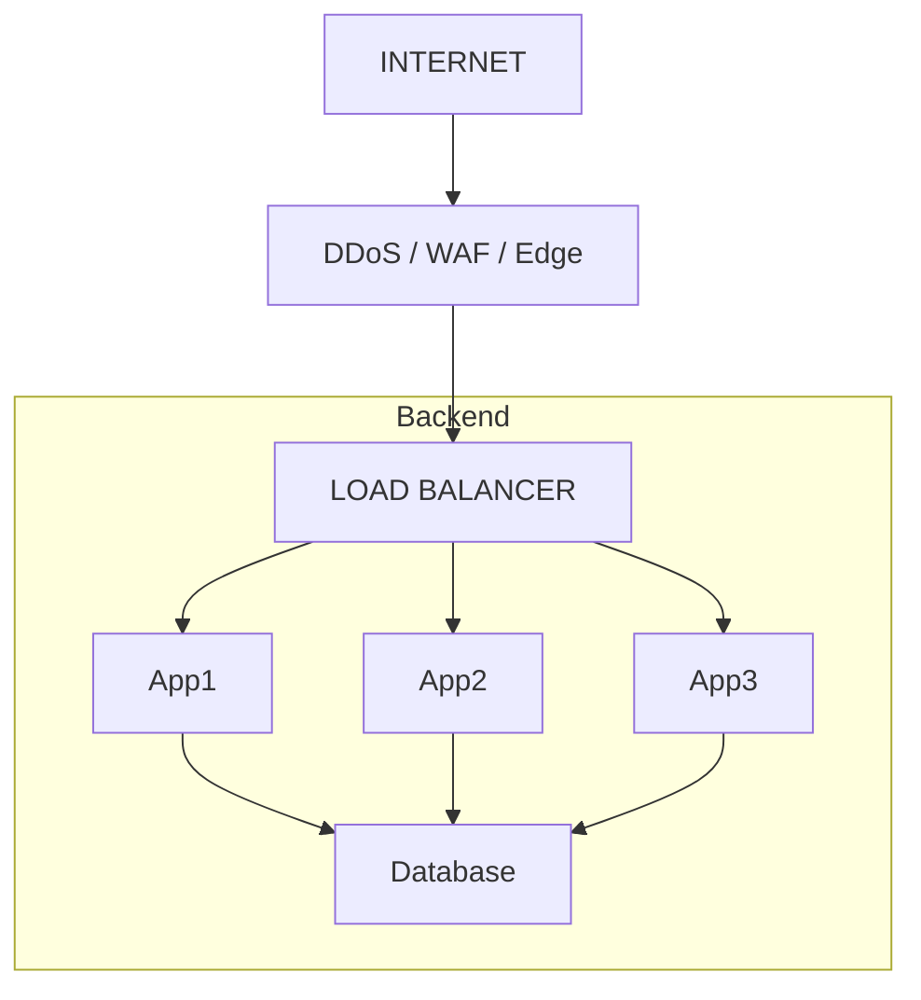
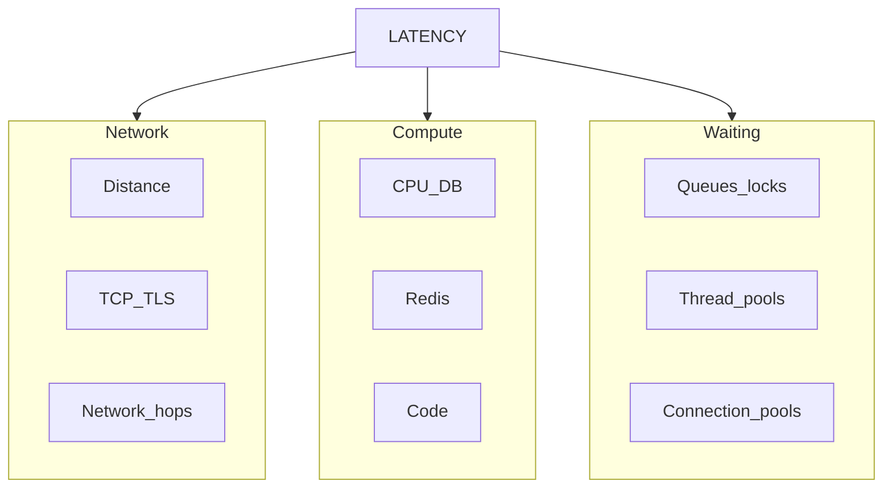

# System Design Concepts

## 1. Scalability

### Definition
Scalability is the ability of a system to handle increasing traffic (users, requests, data) without breaking by adding resources (horizontal or vertical scaling).

### Key Principles

a. **System-wide Property**: Scalability is the property of the entire system. The system is as scalable as its least scalable part.

b. **End-to-End Consideration**: A backend server can scale to handle 10x traffic, but the database must also be scalable to support the increased connection requests.

c. **Measurable Capacity**: Scalability should ideally be expressed as measurable capacity + how that capacity changes when resources increase.

### Scalability Metrics Example

| Metric | 1× load | 10× load |
|--------|---------|----------|
| Traffic | 10K RPS | 100K RPS |
| App servers | 5 | 50 |
| p99 latency | 150 ms | 180 ms |
| Error rate | 0.05% | 0.08% |
| DB CPU | 55% | 65% |
| DB capacity | 15K RPS | 120K RPS |

---

## 2. Load Balancer

### Overview
A load balancer distributes incoming requests across multiple servers.

### Key Functions

a. **Request Distribution**: Distributes incoming requests across multiple servers.

b. **Health Checks**: Performs health checks on backend servers.

c. **Horizontal Scaling**: Supports horizontal scaling by enabling addition of more servers.

### Load Balancer Types

#### L4 (Layer 4) - TCP/UDP Level
- Routes based on network information
- L4 sees: Source IP, Destination IP, Source Port, Destination Port, TCP/UDP

#### L7 (Layer 7) - HTTP Level
- Routing decision based on HTTP method, headers, paths, host, and cookies

### Load Balancer Algorithms

1. **Round Robin**: Distributes requests sequentially across servers
2. **Least Connections**: Sends request to server with fewest active connections
3. **IP Hash**: Uses client IP address to determine target server
4. **Consistent Hashing**: Maintains cache coherence when servers are added/removed

### Load Balancer Capacity

| Metric | Capacity |
|--------|----------|
| Requests/sec | 1 million RPS |
| New connections/sec | 100K/sec |
| Concurrent connections | 5 million |
| Throughput | 20 Gbps |
| TLS handshakes/sec | 50K/sec |
| P99 Latency | < 20 ms |

---

### Rate Limiting Architecture

Load balancers often implement a two-layer rate limiting approach:

#### a. Edge Protection (at Load Balancer)
- DDoS protection
- Abusive IPs
- Traffic floods
- Obviously malicious traffic

#### b. API/Business Rate Limiting (at API Gateway)
Protects API based on:
- User
- API keys
- Tenant
- Endpoints
- Subscription tier
- Business rules

### System Architecture Diagram



## 3. Latency

### Definition
Latency is the time between sending a request and receiving a response. Latency is measured in percentiles.

### Percentile-based Measurement

- **p50** = 50th percentile (median)
- **p95** = 95th percentile
- **p99** = 99th percentile

#### Example
```
p50 = 50 ms
p95 = 120 ms
p99 = 300 ms
```

**Interpretation**: 1% of requests are taking more than 300 ms.

#### When to use Average vs Percentiles?
- **Average latency** can hide tail latency. Use average to understand overall behavior.
- **Percentiles** help understand user experience and tail latency.

### Latency Components

Latency is composed of multiple components:

| Component | Description |
|-----------|-------------|
| Network Latency | Time for data to travel across the network |
| LB Processing | Load balancer processing time |
| Application Processing | Server application logic execution |
| Redis Latency | Cache lookup/update time |
| Database Latency | Database query execution |

#### Example Breakdown
```
Network        30 ms
LB              5 ms
Application    20 ms
Redis           2 ms
DB             50 ms
-------------------
Total         107 ms
```

### Key Questions to Consider

a. Can my server process the required traffic while keeping p95/p99 latency within our SLO?

b. Every network hop adds latency.

c. **How to reduce latency:**
   - Keep the server/DB near to the user
   - Use caching

d. **Reasons for high p99 latency (e.g., 500ms):**
   - User far from server (network latency)
   - High traffic - CPU/threads/connections become saturated
   - Background processing - CPU contention, thread contention or GC pause
   - DB background tasks - DB contentions, locks, I/O, connection pool exhaustion, slow queries
   - Downstream service latency

### Latency Diagram



---

## 4. Throughput

### Definition

**Throughput** = How much work a system can process per unit of time.

### Real-World Throughput Examples

| Component | Throughput |
|-----------|------------|
| API | 10,000 requests/sec (RPS) |
| Database | 50,000 queries/sec |
| Kafka | 100MB/sec |
| File Processing | 1,000 files/minute |

### Throughput vs Latency

```
Latency = How long one request takes.
Throughput = How many requests you can process per second.
```

**Key Distinction:**
- **Latency** measures the duration of a single request
- **Throughput** measures the volume of requests processed over time

### Throughput Depends on Resources

Throughput is constrained by multiple factors:

- **CPU** - Processing power for request handling
- **Memory** - Available RAM for concurrent operations
- **Network** - Bandwidth and connection limits
- **Disk I/O** - Storage read/write performance
- **Database** - Query execution capacity
- **Connections** - Concurrent connection limits
- **Thread pools** - Worker thread availability
- **Queues** - Buffer capacity for pending work
- **Downstream services** - Dependencies' capacity

**Overall throughput is often constrained by the slowest/most capacity-limited component** (bottleneck).

### Throughput and Concurrency

**Amdahl's Law relationship:**
```
Concurrency ≈ Throughput × Latency
```

**Example:**
```
Throughput = 1,000 requests/sec
Latency    = 200 ms = 0.2 sec

Concurrency ≈ 1,000 × 0.2
            = 200 requests
```

This means you need approximately 200 concurrent requests to achieve 1,000 RPS with 200ms latency.

### Throughput has a Workload Dimension

**Example: 10K RPS system requirements:**
- 10K GET requests/sec
- 50K DB queries/sec (each request triggers 5 DB queries)
- 20K Redis operations/sec (caching layer)
- 10K downstream calls/sec (external service integrations)

**Interview Tip:** When asked to design a system for 10K RPS, always ask: *"What does each request involve?"* The actual database, cache, and external service requirements may be 5-10x the API RPS.

### SLI, SLO, and SLA

| Term | Definition | Example |
|------|------------|---------|
| **SLI** (Service Level Indicator) | What we measure | p99 latency, error rate, throughput |
| **SLO** (Service Level Objective) | What target we want | p99 latency < 200ms, 99.99% availability |
| **SLA** (Service Level Agreement) | What we promise the customer | 99.9% uptime with credits for breaches |

**Example with your metrics:**
```
API Support:
- Throughput: 10K RPS
- p99 Latency: < 200ms
- Availability: 99.99%
```

### Throughput Optimization Strategies

1. **Identify bottlenecks** - Use monitoring to find the limiting component
2. **Scale horizontally** - Add more servers for stateless components
3. **Use caching** - Reduce database load with Redis/Memcached
4. **Connection pooling** - Reuse database connections
5. **Async processing** - Offload work with message queues (Kafka, RabbitMQ)
6. **Batch processing** - Process multiple items together
7. **Read replicas** - Distribute read load from primary database
8. **CDN** - Serve static content from edge locations

---
