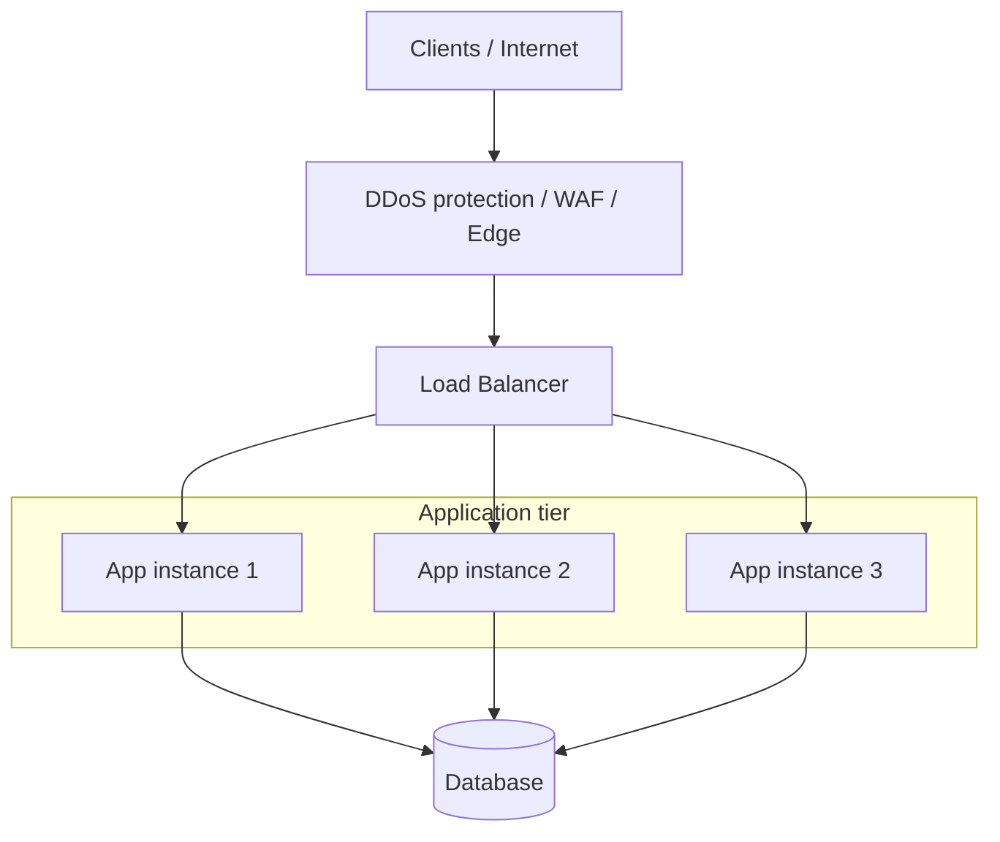
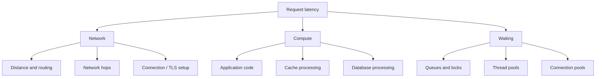
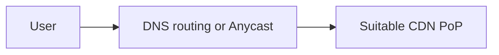
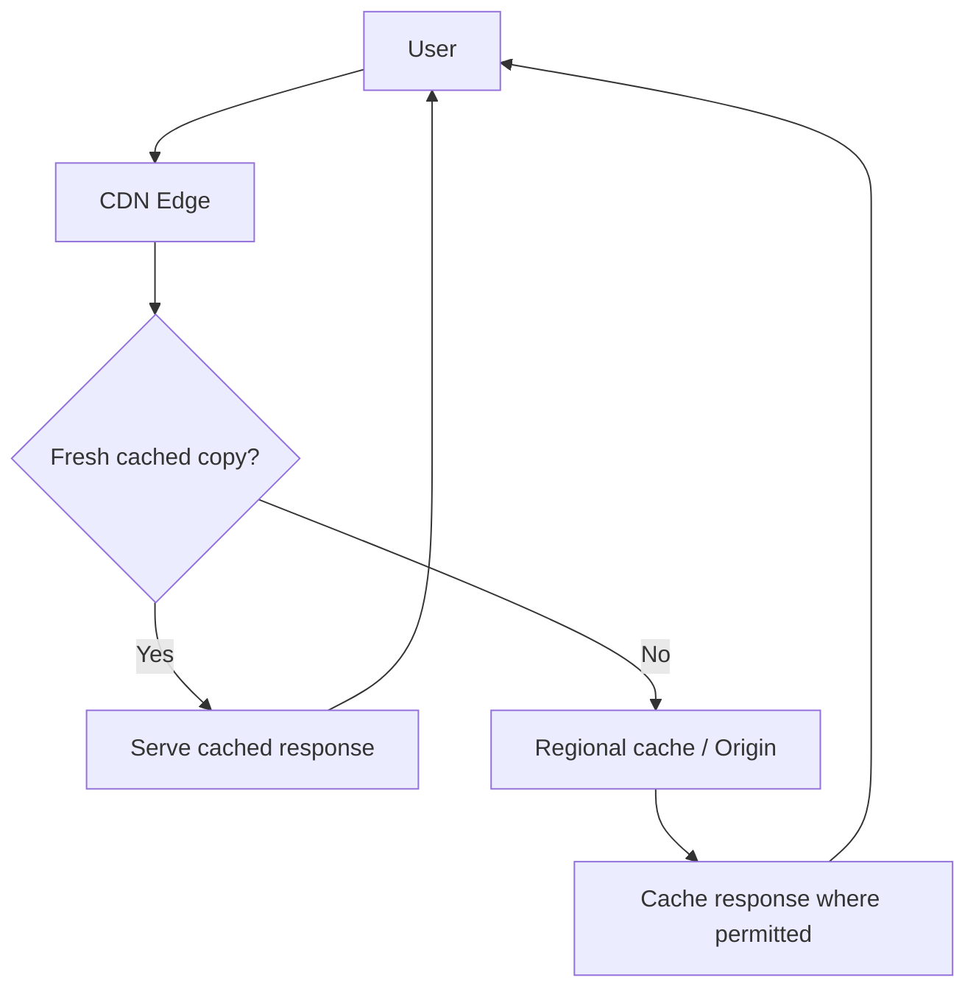
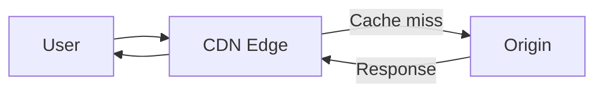
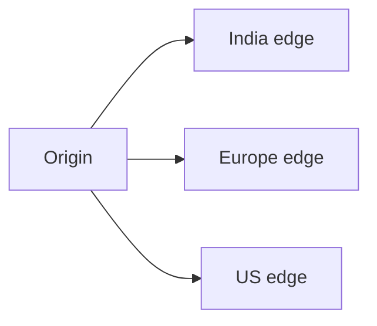
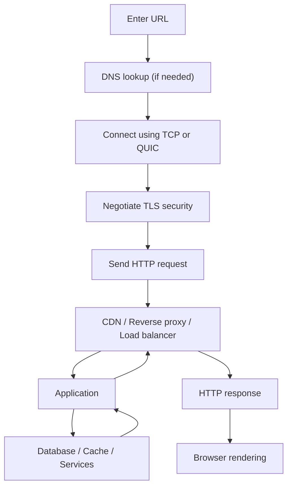
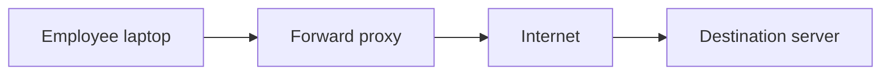

# System Design Concepts

A practical reference for scalability, traffic management, performance, content delivery, DNS, gateways, and proxies. Numeric capacities are examples unless otherwise stated.

## Contents

1. [Scalability](#1-scalability)
2. [Load Balancer](#2-load-balancer)
3. [Latency](#3-latency)
4. [Throughput](#4-throughput)
5. [CDN](#5-cdn)
6. [DNS](#6-dns)
7. [API Gateway](#7-api-gateway)
8. [Forward and Reverse Proxy](#8-forward-and-reverse-proxy)

---

## 1. Scalability

### Definition

Scalability is the ability of a system to handle increasing traffic (users, requests, data) without breaking by adding resources (horizontal or vertical scaling).

### Key Principles

a. **System-wide Property**: Scalability is the property of the entire system. The system is as scalable as its least scalable part.

b. **End-to-End Consideration**: A backend server can scale to handle 10x traffic, but the database must also be scalable to support the increased connection requests.

c. **Measurable Capacity**: Scalability should ideally be expressed as measurable capacity + how that capacity changes when resources increase.

### Scalability Metrics Example

> Illustrative scenario, not benchmark data.

| Metric | 1× load | 10× load |

|--------|---------|----------|

| Traffic | 10K RPS | 100K RPS |

| App servers | 5 | 50 |

| p99 latency | 150 ms | 180 ms |

| Error rate | 0.05% | 0.08% |

| DB CPU | 55% | 65% |

| DB capacity | 15K RPS | 120K RPS |

---

## 2. Load Balancer

### Overview

A load balancer distributes incoming requests across multiple servers.

### Key Functions

a. **Request Distribution**: Distributes incoming requests across multiple servers.

b. **Health Checks**: Performs health checks on backend servers.

c. **Horizontal Scaling**: Supports horizontal scaling by enabling addition of more servers.

### Load Balancer Types

#### L4 (Layer 4) - TCP/UDP Level

- Routes based on network information

- L4 sees: Source IP, Destination IP, Source Port, Destination Port, TCP/UDP

#### L7 (Layer 7) - HTTP Level

- Routing decision based on HTTP method, headers, paths, host, and cookies

### Load Balancer Algorithms

1. **Round Robin**: Distributes requests sequentially across servers

2. **Least Connections**: Sends request to server with fewest active connections

3. **IP Hash**: Uses client IP address to determine target server

4. **Consistent Hashing**: Minimizes reassignment of keys or sessions when backend nodes are added or removed (when hash-based routing is appropriate)

### Load Balancer Capacity (Illustrative Only)

> These are hypothetical example values, not standard specifications for all load balancers. Actual capacity depends on software, hardware, protocol, TLS settings, and workload.

| Metric | Capacity |

|--------|----------|

| Requests/sec | 1 million RPS |

| New connections/sec | 100K/sec |

| Concurrent connections | 5 million |

| Throughput | 20 Gbps |

| TLS handshakes/sec | 50K/sec |

| P99 Latency | < 20 ms |

---

### Rate Limiting Architecture

Load balancers often implement a two-layer rate limiting approach:

#### a. Edge Protection (at Load Balancer)

- DDoS protection

- Abusive IPs

- Traffic floods

- Obviously malicious traffic

#### b. API/Business Rate Limiting (at API Gateway)

Protects API based on:

- User

- API keys

- Tenant

- Endpoints

- Subscription tier

- Business rules

### System Architecture Diagram


```mermaid
flowchart TD
    Client["Clients / Internet"] --> Edge["DDoS protection / WAF / Edge"]
    Edge --> LB["Load Balancer"]
    subgraph Backend[Application tier]
        App1["App instance 1"]
        App2["App instance 2"]
        App3["App instance 3"]
    end
    LB --> App1
    LB --> App2
    LB --> App3
    App1 --> DB[(Database)]
    App2 --> DB
    App3 --> DB
```
## 3. Latency

### Definition

Latency is the time between sending a request and receiving a response. Latency is measured in time units (such as milliseconds) and is often reported using percentiles.

### Percentile-based Measurement

- **p50** = 50th percentile (median)

- **p95** = 95th percentile

- **p99** = 99th percentile

#### Example

```
p50 = 50 ms

p95 = 120 ms

p99 = 300 ms

```
**Interpretation:** Approximately 99% of requests complete within 300 ms, while approximately 1% take longer (depending on the percentile calculation).

#### When to use Average vs Percentiles?

- **Average latency** can hide tail latency. Use average to understand overall behavior.

- **Percentiles** help understand user experience and tail latency.

### Latency Components

Latency is composed of multiple components:

| Component | Description |

|-----------|-------------|

| Network Latency | Time for data to travel across the network |

| LB Processing | Load balancer processing time |

| Application Processing | Server application logic execution |

| Redis Latency | Cache lookup/update time |

| Database Latency | Database query execution |

#### Example Breakdown

```
Network        30 ms

LB              5 ms

Application    20 ms

Redis           2 ms

DB             50 ms

-------------------

Total         107 ms

```
### Key Questions to Consider

a. Can my server process the required traffic while keeping p95/p99 latency within our SLO?

b. Every network hop adds latency.

c. **How to reduce latency:**

   - Keep the server/DB near to the user

   - Use caching

d. **Reasons for high p99 latency (e.g., 500ms):**

   - User far from server (network latency)

   - High traffic - CPU/threads/connections become saturated

   - Background processing - CPU contention, thread contention or GC pause

   - DB background tasks - DB contentions, locks, I/O, connection pool exhaustion, slow queries

   - Downstream service latency

### Latency Diagram


```mermaid
flowchart TD
    L["Request latency"] --> N["Network"]
    L --> C["Compute"]
    L --> W["Waiting"]
    N --> D["Distance and routing"]
    N --> H["Network hops"]
    N --> T["Connection / TLS setup"]
    C --> A["Application code"]
    C --> R["Cache processing"]
    C --> DB["Database processing"]
    W --> Q["Queues and locks"]
    W --> TP["Thread pools"]
    W --> CP["Connection pools"]
```
---

## 4. Throughput

### Definition

**Throughput** = How much work a system can process per unit of time.

### Illustrative Throughput Examples

| Component | Throughput |

|-----------|------------|

| API | 10,000 requests/sec (RPS) |

| Database | 50,000 queries/sec |

| Kafka | 100MB/sec |

| File Processing | 1,000 files/minute |

### Throughput vs Latency

```
Latency = How long one request takes.

Throughput = How many requests you can process per second.

```
**Key Distinction:**

- **Latency** measures the duration of a single request

- **Throughput** measures the volume of requests processed over time

### Throughput Depends on Resources

Throughput is constrained by multiple factors:

- **CPU** - Processing power for request handling

- **Memory** - Available RAM for concurrent operations

- **Network** - Bandwidth and connection limits

- **Disk I/O** - Storage read/write performance

- **Database** - Query execution capacity

- **Connections** - Concurrent connection limits

- **Thread pools** - Worker thread availability

- **Queues** - Buffer capacity for pending work

- **Downstream services** - Dependencies' capacity

**Overall throughput is often constrained by the slowest/most capacity-limited component** (bottleneck).

### Throughput and Concurrency

**Little's Law (for a stable system):**

```
Concurrency ≈ Throughput × Latency

```
**Example:**

```
Throughput = 1,000 requests/sec

Latency    = 200 ms = 0.2 sec

Concurrency ≈ 1,000 × 0.2

            = 200 requests

```
This corresponds to approximately 200 in-flight requests at 1,000 RPS with 200 ms average response time, assuming a stable system. Use average latency—not p99—in this relationship.

So concurrency answers "how many are in progress?", while throughput answers "how many finish per second?".

### Throughput has a Workload Dimension

**Example: 10K RPS system requirements:**

- 10K GET requests/sec

- 50K DB queries/sec (each request triggers 5 DB queries)

- 20K Redis operations/sec (caching layer)

- 10K downstream calls/sec (external service integrations)

**Interview Tip:** When asked to design a system for 10K RPS, always ask: **"What does each request involve?"** The actual database, cache, and external service requirements may be 5-10x the API RPS.

### SLI, SLO, and SLA

| Term | Definition | Example |

|------|------------|---------|

| **SLI** (Service Level Indicator) | What we measure | p99 latency, error rate, throughput |

| **SLO** (Service Level Objective) | What target we want | p99 latency < 200ms, 99.99% availability |

| **SLA** (Service Level Agreement) | What we promise the customer | 99.9% uptime with credits for breaches |

**Example with your metrics:**

```
API target:

- Throughput: 10K RPS

- p99 Latency: < 200ms

- Availability: 99.99%

```
### Throughput Optimization Strategies

1. **Identify bottlenecks** - Use monitoring to find the limiting component

2. **Scale horizontally** - Add more servers for stateless components

3. **Use caching** - Reduce database load with Redis/Memcached

4. **Connection pooling** - Reuse database connections

5. **Async processing** - Offload work with message queues (Kafka, RabbitMQ)

6. **Batch processing** - Process multiple items together

7. **Read replicas** - Distribute read load from primary database

8. **CDN** - Serve static content from edge locations

---

## 5. CDN

### Definition

**CDN (Content Delivery Network)** = A network of globally distributed **edge servers** that cache and serve content closer to users, reducing latency and origin-server load.

Commonly cached content:

- Images

- Videos/video segments

- CSS/JavaScript

- Static HTML

- Files/downloads

- Cacheable API responses

### System Design Use Cases

| System | CDN Usage |

|---|---|

| **YouTube / Netflix** | Videos, video segments, thumbnails |

| **Instagram** | Photos, videos, reels, profile images |

| **Facebook / X** | Images, videos, static assets |

| **Amazon / E-commerce** | Product images, CSS, JS, static pages |

| **News Websites** | Articles, images, other cacheable content |

### How does CDN select an Edge Server?

CDNs commonly use **DNS-based routing and/or Anycast**.

- **DNS routing:** DNS directs the client toward a suitable CDN point of presence (PoP) based on location, availability, and network conditions.
- **Anycast:** Multiple CDN PoPs announce the same IP address; BGP routing selects a reachable PoP based on network topology and routing policy, which is not necessarily geographically nearest.


```mermaid
flowchart LR
    User["User"] --> Routing["DNS routing or Anycast"]
    Routing --> POP["Suitable CDN PoP"]
```
### What happens on a Cache Miss?

When requested content is missing or stale at the edge, the CDN can fetch or revalidate it with a regional cache or origin.


```mermaid
flowchart TD
    User["User"] --> Edge["CDN Edge"]
    Edge --> Check{"Fresh cached copy?"}
    Check -- Yes --> Hit["Serve cached response"]
    Check -- No --> Origin["Regional cache / Origin"]
    Origin --> Save["Cache response where permitted"]
    Save --> User
    Hit --> User
```
Subsequent requests can be served from the CDN when the cached object remains fresh.

### TTL (Time To Live)

**TTL** defines how long cached content can be considered fresh.

Example:

```text
TTL = 1 hour

```
After expiry, the CDN may fetch/revalidate the content from the origin.

- **Long TTL:** Better cache hit ratio and lower origin load, but higher risk of stale content.

- **Short TTL:** Fresher content, but more origin requests.

### How is Data Distributed to Edge Servers?

Two common approaches:

#### Pull CDN

Content is fetched **on demand**.


```mermaid
flowchart LR
    User["User"] --> Edge["CDN Edge"]
    Edge -- "Cache miss" --> Origin["Origin"]
    Origin -- "Response" --> Edge
    Edge --> User
```
Best when content popularity is unpredictable.

#### Push / Pre-positioning

Content is proactively distributed to selected edge locations **before users request it**.


```mermaid
flowchart LR
    Origin["Origin"] --> India["India edge"]
    Origin --> Europe["Europe edge"]
    Origin --> US["US edge"]
```
Useful for predictable/popular content, such as a major video release.

### Key Interview Topics

**Cache hit/miss · TTL · Cache invalidation · Cache stampede · Origin protection**

- **Cache Invalidation:** Remove/update stale cached content before TTL expires.

- **Cache Stampede:** Many requests hit the origin simultaneously after cached content expires or is invalidated.

---

## 6. DNS

### Definition

**DNS (Domain Name System)** is a distributed directory service that translates human-readable domain names (like www.example.com) into IP addresses that computers can understand.

DNS can be used for traffic routing, directing users to different servers based on their geographic location or the health of the servers.

### DNS Lookup Flow

The DNS resolution process follows this path:

1. Browser/OS cache

2. Recursive DNS resolver

3. Root DNS server

4. TLD (.com) server

5. Authoritative DNS server

6. IP address returned to client

> This is the full lookup path on a cache miss. Cached answers may skip root, TLD, and authoritative lookups.

### Key Concepts

#### Recursive vs Authoritative DNS

- **Recursive DNS Resolver**: Finds and caches DNS answers for clients

- **Authoritative DNS Server**: Holds the actual DNS records for a domain

#### DNS Records

Common DNS record types include:

- **A**: Maps a domain name to an IPv4 address

- **AAAA**: Maps a domain name to an IPv6 address

- **CNAME**: Creates an alias from one domain name to another

- **MX**: Specifies mail servers for a domain

- **TXT**: Stores arbitrary text data for verification and other purposes

- **NS**: Specifies authoritative name servers for a domain

#### TTL (Time To Live)

TTL determines how long DNS resolvers may cache a DNS response:

- **Longer TTL**: Reduces DNS traffic but makes changes propagate more slowly

- **Shorter TTL**: Allows faster propagation of changes but increases DNS traffic

### DNS Caching

DNS caching occurs at multiple levels:

- Browser cache

- Operating system cache

- Recursive resolver cache

This multi-level caching reduces lookup latency and decreases load on DNS infrastructure.

### DNS-based Load Balancing

DNS can distribute traffic by returning different IP addresses for the same hostname. However, DNS caching and client behavior mean it does not provide precise per-request balancing or immediate failover.

### Complete Web Request Flow

A simplified request flow after entering `www.example.com` in a browser:


```mermaid
flowchart TD
    URL["Enter URL"] --> DNS["DNS lookup (if needed)"]
    DNS --> Conn["Connect using TCP or QUIC"]
    Conn --> Secure["Negotiate TLS security"]
    Secure --> Req["Send HTTP request"]
    Req --> Edge["CDN / Reverse proxy / Load balancer"]
    Edge --> App["Application"]
    App --> Dep["Database / Cache / Services"]
    Dep --> App
    App --> Edge
    Edge --> Resp["HTTP response"]
    Resp --> Browser["Browser rendering"]
```
HTTP/1.1 and HTTP/2 typically use TLS over TCP; HTTP/3 uses QUIC, which integrates TLS 1.3. DNS or connection setup may be skipped when cached or reused.

## 7. API Gateway

### Note about frontend applications

Frontend applications built in Angular are downloaded in browser. After loading, the Angular JavaScript executes on the user's machine and calls backend APIs. When an Angular app is packaged with NGINX, it can be deployed to Kubernetes as a frontend-serving workload. NGINX serves the frontend files; the actual Angular application executes in the browser. Angular is typically the client/frontend application. It may be independently deployed and containerized, but I wouldn't call it a backend microservice.

When we execute `ng serve` in local, it starts a development server at port 4200. `http://localhost:4200` The purpose of this server is just to serve the Angular files during development, handle rebuilds/hot reload, etc.

In production, `ng build` produces static files like index.html, main.js, styles.css, assets/. These files are served to the browser and the Angular application executes in the browser. Thus, all the backend APIs are called from the browser

### Definition

API gateway is server-side software/service that acts as an entry point to backend APIs. It handles cross-cutting API concerns like Rate Limiting, Authentication, Authorization polices, Routing, Request transformation, Logging / Metrics Quotas etc.

### Single Entry Point

An API gateway provides clients with a unified entry point to backend APIs.

### Request Routing

The gateway routes requests to the appropriate service.

```text
/users/*    → User Service
/orders/*   → Order Service
/payments/* → Payment Service
```
### TLS Termination

The gateway can terminate HTTPS/TLS. Communication from gateway to backend may then use TLS again, depending on security requirements.

### Observability

It is a useful centralized place for API access logs, request metrics, latency/error monitoring, tracing headers, and auditing.

### Availability

An API gateway must scale and be highly available. Since it sits on the critical request path, it can become a bottleneck/SPOF if poorly designed. Gateways are typically deployed as multiple stateless instances or provided as a managed distributed service.

## 8. Forward and Reverse Proxy

### Definition - Forward Proxy

Forward proxy represents the client. It hides the client. The destination server sees the proxy rather than directly communicating with the original client.

Typical use cases:

- Corporate internet access control

- Blocking websites

- Monitoring/filtering outbound traffic

- Hiding client IP

- Egress control

### Forward Proxy Example


```mermaid
flowchart LR
    Client["Employee laptop"] --> Proxy["Forward proxy"]
    Proxy --> Internet["Internet"]
    Internet --> Server["Destination server"]
```
### Definition - Reverse Proxy

Reverse proxy represents the server/backend. A reverse proxy sits in front of servers. The client doesn't need to know which backend server actually handles the request.

Typical use cases:

- Load balancing

- TLS termination

- Routing

- Caching

- Compression

- Security/WAF integration

- Hiding backend servers
